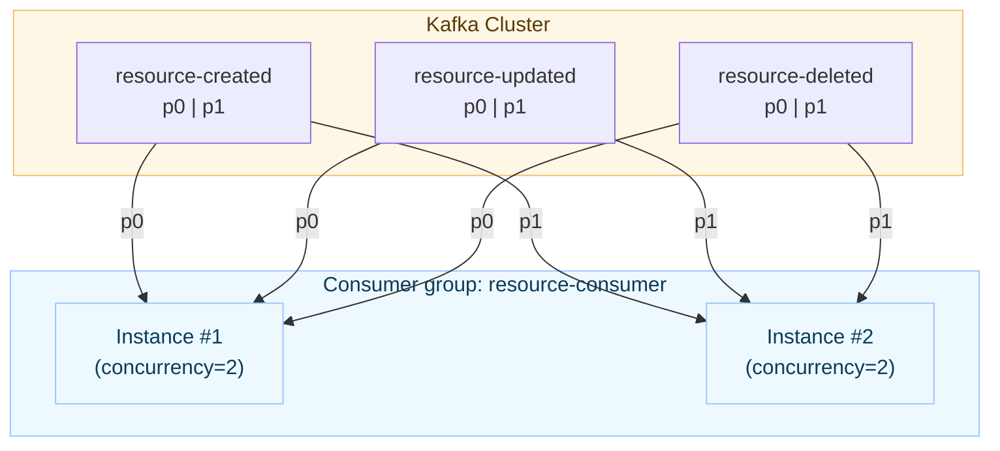

# Gatto RMS

**Gatto RMS** (Resource Management System) is a RESTful system for managing and distributing resources with location
and characteristic data. It supports creation, updating, deletion, retrieval, and notifications via Kafka.

## Common architecture

```mermaid
flowchart LR
  %% Class definitions
  classDef svc fill:#eef9ff,stroke:#9ac7ff,color:#0b3b5c;
  classDef infra fill:#fff7e6,stroke:#f0c36d,color:#5c3b0b;
  classDef db fill:#f3faff,stroke:#b6e3ff,color:#0b3b5c;
  classDef lib fill:#f2f2f2,stroke:#c9c9c9,color:#333,stroke-dasharray: 3 3;

  UI["UI (Angular)"]

  subgraph RS["resource-server (CRUD)"]
    RSapi["REST API"]
    OUTBOX[["Outbox table"]]
    DB1[("(Write DB) PostgreSQL")]
  end

  subgraph RP["resource-publisher"]
    RPsvc["KafkaPublisherService"]
  end

  subgraph KAFKA["Kafka Cluster"]
    Tcreated["resource-created\n(partitions: 0,1)"]
    Tupdated["resource-updated\n(partitions: 0,1)"]
    Tdeleted["resource-deleted\n(partitions: 0,1)"]
  end

  subgraph RC["resource-consumer"]
    RCsvc["@KafkaListener(s)"]
    Mapper["Resource/Characteristic mappers"]
    DB2[("(Read DB) PostgreSQL")]
  end

  CONTRACTS["resource-contracts\n(ResourceView, CharacteristicView, LocationView,\nCharacteristicType, etc.)"]

  %% Flows
  UI -->|CRUD REST| RSapi
  RSapi --> DB1
  RSapi --> OUTBOX

  OUTBOX -.->|CDC/REST polling| RPsvc
  RPsvc -->|JSON(ResourceView)| Tcreated
  RPsvc -->|JSON(ResourceView)| Tupdated
  RPsvc -->|JSON(ResourceView)| Tdeleted

  Tcreated --> RCsvc
  Tupdated --> RCsvc
  Tdeleted --> RCsvc

  RCsvc --> Mapper --> DB2

  %% Class assignments (separate from node definitions)
  class UI,RS,RSapi,OUTBOX,DB1,RP,RPsvc,RC,RCsvc,Mapper,DB2 svc;
  class KAFKA infra;
  class CONTRACTS lib;
```



##  Functional Requirements

- **RESTful API in Java**
    - Create new resources with location and characteristics
    - Retrieve resources by ID or all at once
    - Update existing resources, locations, and characteristics
    - Delete resources

- **Notification System**
    - Send updated resource data to a Kafka topic to notify interested parties

- **Endpoint to broadcast all resources**
    - Provide an endpoint to send the entire database of resources via Kafka

- **Test Data Population**
    - On application startup, the database is seeded with at 6 resources of different types
    - Each resource includes a location and multiple characteristics
    - Two different countries (Estonia and Latvia) are represented among the resources

---

##  Technical Requirements

- Java 21
- Spring Boot
- Flyway for DB migrations
- Docker containerization
- Unit & integration tests

---

## API Endpoints

| Method | Endpoint               | Description                           |
|--------|------------------------|---------------------------------------| 
| POST   | `/api/resources`       | Create a new resource                 |
| GET    | `/api/resources`       | Get list of all resources             |
| PUT    | `/api/resources/{id}`  | Update an existing resource by ID     |
| DELETE | `/api/resources/{id}`  | Delete a resource by ID               |

##  Quick Start

### 1. Clone the Repository

```bash
git clone https://github.com/andreikoshelap/gatto-rms
cd gatto-rms

## 2. Build the Project
./gradlew clean build

### 3. Run with Docker
docker compose up --d
```

### 4. Access the Application
Base URL: http://localhost:4200

This will open Google map, with predefined 5 resources (nb in environment folder of resource-ui module set
file with googleMapsApiKey, this key not commited).
By click on existing marker user can open, update or delete resource.
By double-click on any place in map user can create new resource. 
Any changes with resources goes into
postgres db and then on 3 different topic in kafka module: resource-created-events, resource-updated-events,
resource-deleted-events.

## Example Kafka Message


```bash
{
	"id": 2,
	"type": "CONNECTION_POINT",
	"countryCode": "EE",
	"characteristics": [
		{
			"id": 2,
			"code": "C2",
			"type": "CONSUMPTION_TYPE",
			"value": "medium"
		},
		{
			"id": 9,
			"code": "C20",
			"type": "CHARGING_POINT",
			"value": "low"
		}
	],
	"location": {
		"id": 2,
		"streetAddress": "Harju 10",
		"city": "Tartu",
		"postalCode": "51007",
		"countryCode": "EE",
		"latitude": 58.3776,
		"longitude": 26.729
	}
}
```
