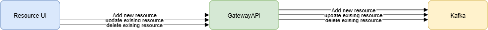

# Gatto RMS

**Gatto RMS** (Resource Management System) is a RESTful service for managing and distributing resources with location and characteristic data. It supports creation, updating, deletion, retrieval, and notification mechanisms via Kafka.

# Common architecture



Source: [diagram.drawio](kafka-gateway.drawio)
---

##  Functional Requirements

- **RESTful API in Java**
    - Create new resources with location and characteristics
    - Retrieve resources by ID or all at once
    - Update existing resources, locations, and characteristics
    - Delete resources

- **Notification System**
    - Send updated resource data to a Kafka topic to notify interested parties

- **Endpoint to broadcast all resources**
    - Provide an endpoint to send the entire database of resources via Kafka

- **Test Data Population**
    - On application startup, the database is seeded with at least 3 resources of different types
    - Each resource includes a location and multiple characteristics
    - At least two different countries are represented among the resources

---

##  Technical Requirements

- Java 21 or higher
- Spring Boot framework
- Database migration tool (Flyway or Liquibase)
- Docker containerization
- Comprehensive unit and integration tests to ensure code quality

---

## API Endpoints

| Method | Endpoint               | Description                           |
|--------|------------------------|---------------------------------------| 
| POST   | `/api/resources`       | Create a new resource                 |
| GET    | `/api/resources`       | Get list of all resources             |
| PUT    | `/api/resources/{id}`  | Update an existing resource by ID     |
| DELETE | `/api/resources/{id}`  | Delete a resource by ID               |

##  Quick Start

### 1. Clone the Repository

```bash
git clone https://github.com/your-org/gatto-rms.git
cd gatto-rms

## 2. Build the Project
mvn clean package

### 3. Run with Docker

```bash
docker-compose up --build
```

### 4. Access the Application
Base URL: http://localhost:4200

Swagger (if enabled): http://localhost:8080/swagger-ui.html

## Example Kafka Message


```bash
{
    "id": 1,
    "type": "METERING_POINT",
    "countryCode": "EE",
    "location": {
        "latitude": 59.436999999999998,
        "longitude": 24.753499999999999
    },
    "characteristics": [
        {
            "code": "C20",
            "type": "CONNECTION_POINT_STATUS",
            "value": "active"
        }
    ]
}
```
