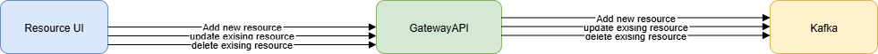

# Gatto RMS

**Gatto RMS** (Resource Management System) is a RESTful system for managing and distributing resources with location
and characteristic data. It supports creation, updating, deletion, retrieval, and notifications via Kafka.

## Common architecture



Source: [diagram.drawio](kafka-gateway.drawio)
---

##  Functional Requirements

- **RESTful API in Java**
    - Create new resources with location and characteristics
    - Retrieve resources by ID or all at once
    - Update existing resources, locations, and characteristics
    - Delete resources

- **Notification System**
    - Send updated resource data to a Kafka topic to notify interested parties

- **Endpoint to broadcast all resources**
    - Provide an endpoint to send the entire database of resources via Kafka

- **Test Data Population**
    - On application startup, the database is seeded with at 6 resources of different types
    - Each resource includes a location and multiple characteristics
    - Two different countries (Estonia and Latvia) are represented among the resources

---

##  Technical Requirements

- Java 21
- Spring Boot
- Flyway for DB migrations
- Docker containerization
- Unit & integration tests

---

## API Endpoints

| Method | Endpoint               | Description                           |
|--------|------------------------|---------------------------------------| 
| POST   | `/api/resources`       | Create a new resource                 |
| GET    | `/api/resources`       | Get list of all resources             |
| PUT    | `/api/resources/{id}`  | Update an existing resource by ID     |
| DELETE | `/api/resources/{id}`  | Delete a resource by ID               |

##  Quick Start

### 1. Clone the Repository

```bash
git clone https://github.com/andreikoshelap/gatto-rms
cd gatto-rms

## 2. Build the Project
./gradlew clean build

### 3. Run with Docker
docker compose up --d
```

### 4. Access the Application
Base URL: http://localhost:4200

This will open Google map, with predefined 5 resources (nb in environment folder of resource-ui module set
file with googleMapsApiKey, this key not commited).
By click on existing marker user can open, update or delete resource.
By double-click on any place in map user can create new resource. 
Any changes with resources goes into
postgres db and then on 3 different topic in kafka module: resource-created-events, resource-updated-events,
resource-deleted-events.

## Example Kafka Message


```bash
{
	"id": 2,
	"type": "CONNECTION_POINT",
	"countryCode": "EE",
	"characteristics": [
		{
			"id": 2,
			"code": "C2",
			"type": "CONSUMPTION_TYPE",
			"value": "medium"
		},
		{
			"id": 9,
			"code": "C20",
			"type": "CHARGING_POINT",
			"value": "low"
		}
	],
	"location": {
		"id": 2,
		"streetAddress": "Harju 10",
		"city": "Tartu",
		"postalCode": "51007",
		"countryCode": "EE",
		"latitude": 58.3776,
		"longitude": 26.729
	}
}
```

## Kubernetes setup for local using 

### Start cluster + ingress
minikube start --driver=docker --cpus=6 --memory=8192
minikube addons enable ingress

### Namespace & context
kubectl apply -f .\k8s\00-namespace.yaml
kubectl config set-context --current --namespace=rms

### Build & load images
minikube image build -t rms/resource-service:local -f resource-service\resource-service.dockerfile resource-service
minikube image build -t rms/resource-publisher:local -f resource-publisher\resource-publisher.dockerfile resource-publisher
minikube image build -t rms/resource-consumer:local -f resource-consumer\resource-consumer.dockerfile resource-consumer
minikube image build -t rms/resource-ui:local        -f resource-ui\resource-ui.dockerfile        resource-ui

### Apply manifests
kubectl apply -f .\k8s\10-postgres.yaml
kubectl apply -f .\k8s\20-kafka.yaml
kubectl apply -f .\k8s\30-apps.yaml
kubectl apply -f .\k8s\40-ui.yaml
kubectl apply -f .\k8s\50-ingress.yaml

### Ingress LoadBalancer + tunnel (pretty URL)
$patch = @{ spec = @{ type = "LoadBalancer" } } | ConvertTo-Json -Compress
kubectl -n ingress-nginx patch svc ingress-nginx-controller --type merge --patch $patch
### (Admin PowerShell) keep open:
minikube tunnel
### hosts: 127.0.0.1  rms.local

### Test
curl.exe -I http://rms.local/
curl.exe -i http://rms.local/api/resources
